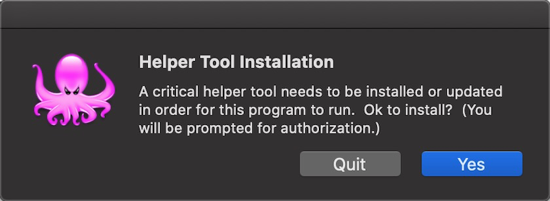
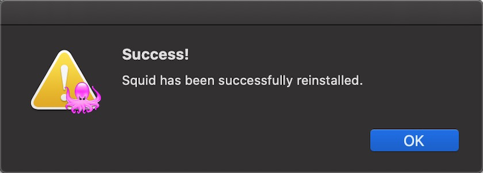
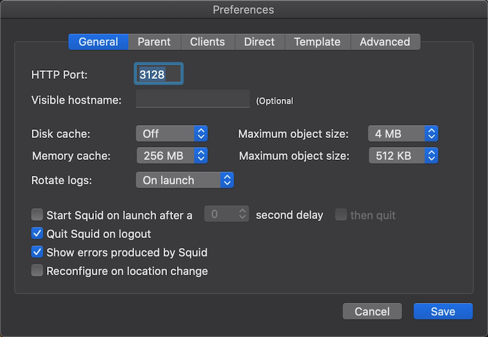
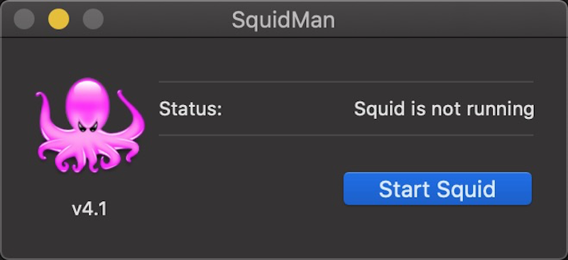
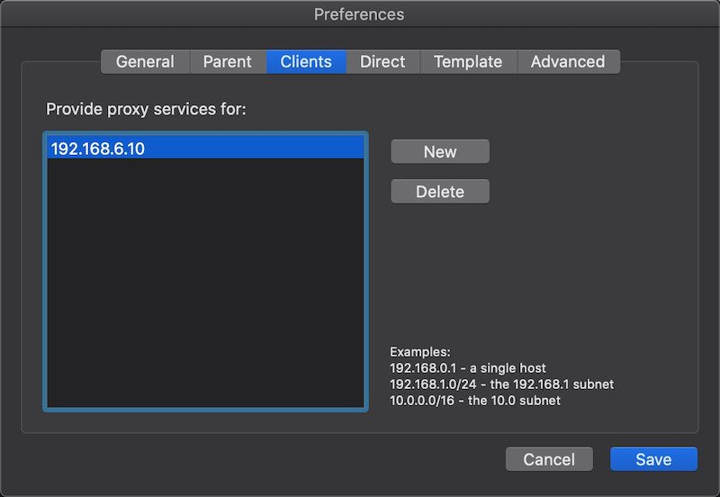

[SquidMan](https://squidman.net/squidman/)是一个MacOS图形安装和管理Squid proxy cache的应用程序，是为了方便"个人"使用的代理服务器。


# 安装

* 从 [SquidMan](https://squidman.net/squidman/) 官方网站下载最新安装包 `SquidMan4.1.dmg` ，将这个应用拖放到 Applications 目录下进行安装。

* 在Launch中点击运行 `SquidMan` ，此时会提示需要安装一个 `Helper Tool Installation` :



* 点击安装Helper，会提示当前系统还没有安装Squid子系统，则点击 `OK` 按钮进行安装:


* 安装Squid之后，SquidMan会提示 `sucessfully reinstalled` :



# 配置

* 基本上所见所得，我只修改了一下代理服务端口，采用squid常用的3128端口



* 保存配置修改，然后点击 `Start Squid` 按钮，启动squid



## 配置允许客户端

* 在apt上配置了代理指向macOS上的squid服务器：

```bash
Acquire::http::Proxy "http://192.168.6.1:3128/";
Acquire::https::Proxy "http://192.168.6.1:3128/";
```

* 升级提示报错

```
Err:13 https://repo.download.nvidia.com/jetson/common r32 InRelease
  Invalid response from proxy: HTTP/1.1 403 Forbidden  Server: squid/4.7  Mime-Version: 1.0  Date: Thu, 16 Apr 2020 09:13:08 GMT  Content-Type: text/html;charset=utf-8  Content-Length: 3512  X-Squid-Error: ERR_ACCESS_DENIED 0  Vary: Accept-Language  Content-Language: en  X-Cache: MISS from localhost  Via: 1.1 localhost (squid/4.7)  Connection: keep-alive     [IP: 192.168.6.1 3128]
...
Err:15 http://ports.ubuntu.com/ubuntu-ports bionic InRelease
  403  Forbidden [IP: 192.168.6.1 3128]
```

这是因为没有配置允许的客户端IP地址，需要在 `SquidMan Preferences` 中设置 `Clients` :



* 然后再次客户端访问则正常访问

# 参考

* [How to Set Up a Proxy Server on Your Mac Using SquidMan](https://howchoo.com/g/mwi3ntu1mjq/how-to-set-up-a-proxy-server-on-mac)