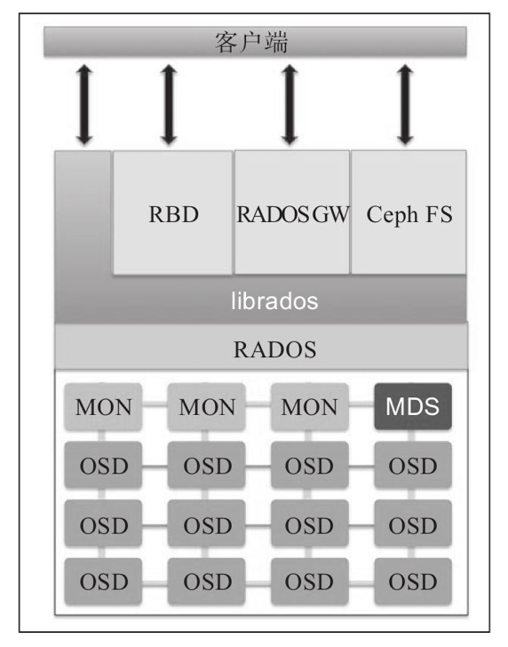

# Ceph架构简介

Ceph是一个真正对统一存储解决方案：从单一统一软件层提供对象、块和文件存储。

Ceph底层并不存在块和文件对管理，而是管理对象并且在对象只支持基于块和文件的存储。Ceph中的对象通过唯一对标识符进行寻址，并且存储在一个扁平对寻址空间。由于剔除了传统文件系统中的元数据操作，对象存储提供了无限对规模扩展和性能提升。

> 传统存储系统每次读写操作都需要查询巨大的元数据表，这对于海量文件存储会导致性能瓶颈，也会限制系统对扩展性。
>
> 传统存储的另一个局限是由RAID所引入的，当前容量极大的企业级磁盘（例如4TB甚至更高容量）已经使得磁盘故障时RAID需要花费数个小时甚至数天时间来修复单个磁盘故障。如果再多磁盘故障甚至导致数据无法恢复。此外RAID要求磁盘规格相同，且要求多个备用磁盘，都使得TCO（总拥有成本）极高。

Ceph通过 **CRUSH算法** 来动态计算存储和获取某个对象对位置。CRUSH即 `Controlled Replication Under Scalable Hashing` 的缩写。通过动态计算元数据，Ceph不需要管理一个集中式元数据表，同时通过分布式存储功能可以将CRUSH计算负载分布到集群的多个节点。

> https://ceph.com/publications/ 提供了相关公开的资料

CRUSH有一个独特的基础设施感知能力，可以了解基础设施中不同组件之间关系：系统磁盘、池、节点、机架、电源插板、交换机、数据中心以及数据中心房间等。CRUSH会以多副本方式存储数据，以保证在故障区域中某些组件出现故障时数据依然可用。

用户可以在Ceph的CRUSH map中自由定义其基础设置的故障区域，上线高效管理数据。

Ceph采用数据副本方式，而不使用RAID，这样能够克服基于RAID带来的很多问题。数据副本可以通过命令高度定制化，并且磁盘故障时，数据恢复的初始副本和复制副本可以分布到集群所有磁盘上。

**不会存在初始副本和复制副本位于同一个磁盘情况** ，所有磁盘都参与数据恢复，使得恢复操作非常快速且没有性能瓶颈。

Ceph采用加权机制选择磁盘，所以不同容量的磁盘不会造成问题。

# Ceph组件

* Monitor - `ceph-mon`
* Manager - `ceph-mgr`
* `OSD` - `ceph-osd` Ceph对象存储服务(object storage daemon)
* `MDS` - `ceph-mds` Ceph存储元数据(stores metadata)，用于实现POSIX文件系统

* RADOS - `Reliable Autononmic Distributed Object Store` 可靠、自动、分布式对象存储

Ceph中一切都以对象形式存储，RADOS负责存储对象，确保数据一致性和可靠性。RADOS执行数据复制、故障检测和恢复，以及数据在集群节点间的迁移和再平衡。RADOS是Ceph存储集群的基础。

当应用程序访问Ceph集群执行写操作，数据会以对象的形式存储在Ceph对象存储设备（OSD）中。OSD是Ceph集群中存储实际用户数据并响应客户端读操作请求的`唯一组件`。

通常OSD守护进程和集群中的一个物理磁盘绑定，即物理磁盘总数和每个物理磁盘的OSD守护继承数量相等。

MON组件通过一系列的map来跟踪整个集群的健康状况，这些map指以下几个组件的map：

* OSD
* MON
* PG
* CRUSH

所有集群节点都向monitor节点报告状态，并分享每个装题啊的变化信息。每个monitor为每个组件维护一个独立的map。

librados库是用来简化访问RADOS的方法，支持PHP, Ruby, Java, Python, C 和 C++ 语言。它提供了Ceph存储集群的一个本地借口RADOS，并且是其他服务（如RBD，RGW）的基础，以及为CephFS提供POSIX借口。librados API支持直接访问RADOS，以便开发者能偶创建自己的借口来访问Ceph集群存储。

Ceph块设备称为 RADOS 块设备（RBD），对外提供块存储，可以被映射、格式化，这样就可以向磁盘一样挂载到服务器。

Ceph对象网管也称为RADOS网关（RGW），提供了兼容Amazon S3 和 OpenStack 对象存储API(Swift)的 restful API借口。RGW还支持多租户和OpenStack的Keystone身份验证服务。

Ceph元数据服务器（MDS）跟踪文件层次结构并存储只提供CephFS使用的元数据。Ceph块设备和RADOS网关不需要元数据，所以不需要Ceph MDS守护进程。

Ceph文件系统（CephFS）提供了一个任意大小且兼容POSIX的分布式文件系统。CephFS依赖Ceph MDS来跟踪文件系统层次结构，即元数据。

> CephFS这样的POSIX文件系统，由于依赖元数据，应该会有类似传统文件系统对海量文件数量的瓶颈，性能和稳定性可能会收到牵连。是否可以用于生产环境，需要跟踪社区发展。

## Ceph块存储

## `新`存储后端引擎 - BlueStore

2017年，Ceph引入了[新的存储后端BlueStore](https://ceph.com/community/new-luminous-bluestore/)。BlueStore存储引擎提供了更好的性能（写入性能2x），完全的数据校验，和内建的压缩功能。

从Ceph Luminous v12.2.z开始，Ceph OSD使用BlueStore作为默认存储后端，并且在ceph-disk, ceph-deploy和ceph-ansible时默认使用。

# 参考

* 「Ceph分布式存储学习指南」
* [Ceph Document](http://docs.ceph.com/)