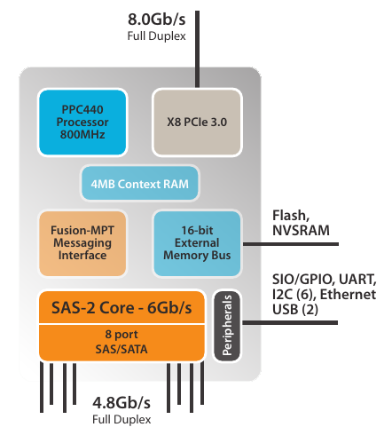

[SAS2308 I/O控制器](https://www.broadcom.com/products/storage/sas-sata-controllers/sas-2308#overview)是一个入门级扩展存储控制芯片

* 支持SAS和SATA，支持RAID 0/1/10，PCIe 3.0规范
* 8个PCIe通道(即提供8个端口控制设备)每个通道8.0GT/s，并兼容5.0/2.5GT/s数据传输（PCI3 2.x, 1.x），最高6Gb/s带宽（6Gb/s per lane）
* 集成`SR-IOV`支持，最高支持16个虚拟设备
* 具有高级错误报告（Advanced Error Reporting,AER）的端到端CRC(End-to-End CRC, ECRC)
* 无需扩展内存支持10,000 IO并每一达到每秒60万IOs

典型外接存储拓扑：

