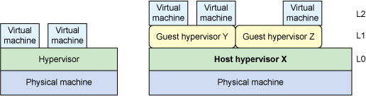

嵌套虚拟化（nested virtualization）是一种在虚拟机内部运行虚拟机的技术，也就是在Hypervisor之上再运行Hypervisor。

传统的虚拟管理程序Hypervisor 在嵌套虚拟化中转变成了嵌套的Hypervisor(Host Hypervisor 之上运行着多个Guest Hypervisor):

传统的虚拟化部分处理了指令集，直接执行处理器上的某些指令，并通过陷阱模仿其他指令。在嵌套虚拟化中，引入了另一个级别，在这一级别上，某些指令继续直接在硬件上执行，而其他指令则被捕获并托管在一层或其他层中（具有用于各层之间的转换的有效负载）。 

> 这种设置会公开处理器虚拟化实现中的优势和劣势：VM 控制结构 (VMCS) 的管理就是这样的一个领域。在 Intel 的实现中，读写这些结构涉及到一些特权指令，要求跨嵌套堆栈的各层进行多次出入。这些转换会带来有效负载，以性能降低的形式表现出来。

# MMU 和内存虚拟化

Intel 和 AMD 通过添加二维页表来解决虚拟机管理程序模仿内存管理单元 (MMU) ：Intel 称之为扩展页表 (EPT)，AMD 称之为嵌套页表 (NPT)。这些协助允许二级页表将 Guest 物理地址转变为主机物理地址（而传统页表则继续支持 Guest 虚拟到 Guest 物理的转换）。 

# I/O 设备虚拟化

仿真（由 QEMU 提供）最为昂贵，像半虚拟化（让 Guest 了解并用虚拟机管理程序协调 I/O）这样的方式能够提升总体性能。最有效的方案是使用像 AMD I/O MMU (IOMMU) 这样的硬件协助来提供 Guest 物理地址到主机物理地址的透明转换（用于直接内存访问 [DMA] 这样的操作）。 

# 嵌套虚拟化性能

根据使用的模型，KVM 中的嵌套可能导致的有效负载可以忽略不计。

促使 VM 退出的工作负载（比如外部中断处理）常常是最坏的情况，但 KVM 内的优化则会带来 6% 到 14% 的负载提升。

考虑到嵌套虚拟化所提供的功能，这个有效负载当然还是合理的。处理器架构的进步将会进一步改善这一点。 

# 嵌套虚拟化主要的用途

* 在Hypervisor之上再运行一层Hypervisor，可以实现不同虚拟化技术的嵌套，例如在KVM之上运行Xen，或者相反，对于私有云迁移到公有云之上，依然保留用户原有的技术架构具有重大意义。
* 可以在一个硬件服务器上模拟大规模的虚拟化集群，而不是一台物理服务器上只能运行一个虚拟化host主机：例如，可以在一台服务器上部署OpentStack集群，只要有足够的cpu和内存资源，可以部署一个非常复杂的开发测试环境。

# 不同虚拟化技术的嵌套虚拟化

* Linux KVM在启用了虚拟化功能的处理器上（如Intel处理器的VMX）支持虚拟化嵌套
* 微软[借助嵌套虚拟化在虚拟机中运行 Hyper-V](https://docs.microsoft.com/zh-cn/virtualization/hyper-v-on-windows/user-guide/nested-virtualization)
* OpenStack可以实现在嵌套虚拟化基础架构上构建模拟的虚拟化技术 - 例如[Configure DevStack with KVM-based Nested Virtualization](https://docs.openstack.org/devstack/latest/guides/devstack-with-nested-kvm.html)

# 参考

* [面向下一代云的嵌套虚拟化: 简介用 KVM 进行嵌套](https://www.ibm.com/developerworks/cn/cloud/library/cl-nestedvirtualization/index.html)