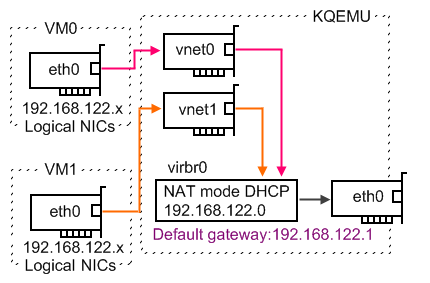

# KVM的NAT虚拟网络

[默认部署的KVM环境](deploy_kvm_on_centos)使用了一个NAT方式的虚拟网络环境，这样创建的虚拟机可以访问外网，但是外部却不能访问虚拟机的服务。

要在NAT网络提供对外服务，需要在物理主机上设置IP Forwarding，将物理主机的网络端口映射到虚拟主机的网络端口。不过，在此之前还需要确保每个虚拟机启动时获得固定的IP地址，以保证端口映射正确。



> 从Red Hat Enterprise Linux 6.1开始，使用一个称为`vhost-net`的内核级guest网络来负责guest和host系统之间的网络数据包收发。这样可以避免内核态和用户态的上下文切换提高性能。要使用`vhost-net`支持，在启动kvm的`-netdev`选项中添加`vhost=on`。默认libvirt将使用内核级`vhost-net`。

```
-net nic,model=virtio,macaddr=00:16:3e:00:01:01,netdev=nic-0
-netdev tap,id=nic-0,script=/root/ifup-br0,downscript=/root/ifdown-br0,vhost=on
```

# libvirt和DHCP

在NAT模式下，libvirt使用了内建的`dnsmasq`来提供DHCP和DNS解析，可以通过在virsh中设置固定的DHCP IP地址和虚拟机MAC地址绑定来确保每次分配给vm相同的IP地址。

* 首先找出vm的MAC地址

```
virsh dumpxml $VM_NAME | grep 'mac address'
```

* 编辑网络

```
virsh  net-list
virsh  net-edit  $NETWORK_NAME
```

> 这里 `$NETWORK_NAME` 通常是`default`

编辑`<dhcp>`段落

```
<dhcp>
  <range start='192.168.122.100' end='192.168.122.254'/>
  <host mac='52:54:00:6c:3c:01' name='vm1' ip='192.168.122.11'/>
  <host mac='52:54:00:6c:3c:02' name='vm2' ip='192.168.122.12'/>
  <host mac='52:54:00:6c:3c:03' name='vm3' ip='192.168.122.13'/>
</dhcp>
```

然后重启虚拟机，或者重启虚拟机中的DHCP客户端。

> 我的实践证明，`net-edit`之后保存，虚拟机的DHCP获得的IP地址依然是原先分配的IP地址，并没有按照设想中那样能够通过重启虚拟机或者重启DHCP客户端来更改成静态分配IP。

经过实践，在`virsh net-edit`修改以后还需要使用如下命令重新创建`default`网络。此时因为运行中的虚拟机原先连接的`virtbr0`被销毁了，就算重建同样的虚拟交换机，运行的vm也没有连接上去。所以需要停止虚拟机，再次启动虚拟机才能识别新创建的同名`default`网络的`virtbr0`交换机并连接。网络才能分配正确的DHCP IP地址。

```
virsh  net-destroy default
virsh  net-start default 
```

注意：此时原先连接`default`网络的虚拟机的网络都会不通，这是因为这些虚拟机的虚拟网卡没有连接到重建的虚拟网桥上。解决的方法是关闭虚拟机再启动虚拟机（不是直接重启，而是先shutdown虚拟机，确实关闭之后再start），但是更简单的方法是使用如下命令重新简介虚拟网卡到网桥：

`brctl show`检查网桥名字，可以看到是`virbr0`

```
#brctl show
bridge name	bridge id		STP enabled	interfaces
virbr0		8000.525400fa6cfe	yes		virbr0-nic
```

物理服务器上通过`ifconfig -a`可以看到所有的虚拟机的虚拟机网卡，例如`vnet0`、`vnet1`...，执行以下命令添加连接

```
brctl addif virbr0 vnet0
brctl addif virbr0 vnet1
...
```

> `/var/lib/libvirt/dnsmasq/` 目录下有 `virbr0.status` 显示当前dnsmasq分配的IP情况。
>
> 通过解析这个文件进行监控，就可以知道当前主机分配的IP地址，通过脚本可以设置端口映射。


如果依然不生效，则可以尝试(实际我验证上述方法已经成功，不需要再执行这几个步骤)

* 停止 `libvirtd` 服务

```
sudo systemctl stop libvirtd
```

* 杀死所有的dnsmasq进程

```
ps aux | grep dnsmasq | grep -v grep | awk '{print $2}' |  sudo xargs kill
```

* 再次启动 `libvirtd` 服务

```
sudo systemctl start libvirtd
```

# dnsmasq静态IP分配

> 本段落是针对dnsmasq的独立配置，说明如何配置dnsmasq静态IP分配，`livirt`则建议通过`virsh net-edit`方式修改，避免冲突覆盖

参考 [DHCP static IP addresses with dnsmasq](http://johnbokma.com/mexit/2008/09/03/dhcp-static-ip-dnsmasq.html) 对于dnsmasq需要有2个文件来配置静态IP

* `/etc/hosts`

```
127.0.0.1 localhost.
192.168.1.100 ecce
192.168.1.101 cadwal
192.168.1.101 lc.johnbokma.com
192.168.1.102 throy
```

* `/etc/ethers`

```
# ecce - Dell Vostro 200 ST
xx:xx:xx:xx:xx:xx 192.168.1.100

# cadwal - Compaq Presario SR1505LA
xx:xx:xx:xx:xx:xx 192.168.1.101

# throy - Acer Aspire 4320
xx:xx:xx:xx:xx:xx 192.168.1.102
```

重启`dnsmasq`会在 `/var/log/messages`日志显示IP分配情况。

# 端口映射

在默认的KVM NAT配置中提供了一个`masquerade`配置，即将虚拟网桥`virtbr0`连接的虚拟网络通过NAT方式访问外网，使用以下命令可以看到配置

```
iptables -t nat -L
```

显示输出

```
Chain PREROUTING (policy ACCEPT)
target     prot opt source               destination
DOCKER     all  --  anywhere             anywhere             ADDRTYPE match dst-type LOCAL

Chain INPUT (policy ACCEPT)
target     prot opt source               destination

Chain OUTPUT (policy ACCEPT)
target     prot opt source               destination
DOCKER     all  --  anywhere            !loopback/8           ADDRTYPE match dst-type LOCAL

Chain POSTROUTING (policy ACCEPT)
target     prot opt source               destination
RETURN     all  --  192.168.122.0/24     base-address.mcast.net/24
RETURN     all  --  192.168.122.0/24     255.255.255.255
MASQUERADE  tcp  --  192.168.122.0/24    !192.168.122.0/24     masq ports: 1024-65535
MASQUERADE  udp  --  192.168.122.0/24    !192.168.122.0/24     masq ports: 1024-65535
MASQUERADE  all  --  192.168.122.0/24    !192.168.122.0/24
MASQUERADE  all  --  192.168.0.0/20       anywhere

Chain DOCKER (2 references)
target     prot opt source               destination
RETURN     all  --  anywhere             anywhere
```

测试案例中运行了以下虚拟机

```
192.168.122.11 devstack
```

在启动脚本 `/etc/rc.loacl` 中 `exit 0` 之前添加以下内容

```
(
# Make sure the libvirt has started and has initialized its network.
while [ `ps -e | grep -c libvirtd` -lt 1 ]; do
        sleep 1
done
sleep 10
# Set up custom iptables rules.
iptables -t nat -I PREROUTING -p tcp -d 192.168.1.100 --dport 1122 -j DNAT --to-destination 192.168.122.11:22
iptables -t nat -I PREROUTING -p tcp -d 192.168.1.100 --dport 1180 -j DNAT --to-destination 192.168.122.11:80
iptables -I FORWARD -m state -d 10.0.0.0/24 --state NEW,RELATED,ESTABLISHED -j ACCEPT
) &
```

> 这里`192.168.1.100`是物理服务器的对外IP地址，我们需要把访问物理服务器的端口映射到虚拟机(注意，使用了特别的端口`1180`和`1122`以避免和物理服务器冲突)

# virsh nwfilter

上述通过`iptables`方式设置端口映射是一种比较简单同时也是比较通用的方法。不过在libvirt体系中，提供了更为复杂和更为完善的防火墙设置，是内建在`libvirt`中，提供了对整个防火墙操作的抽象。这样不仅可以兼容低版本操作系统（使	用iptables）也可以用于更高的使用firewalld的操作系统。但是学习曲线会又些陡峭。

我准备单独开设一章来实践[libvirt中的防火墙和网络过滤](../../../virtual/libvirt/firewall_and_network_filtering_in_libvirt)

# 参考

* [KVM/libvirt: How to configure static guest IP addresses on the virtualisation host](http://serverfault.com/questions/627238/kvm-libvirt-how-to-configure-static-guest-ip-addresses-on-the-virtualisation-ho)
* [How can I port forward with iptables?](http://serverfault.com/questions/140622/how-can-i-port-forward-with-iptables)
* [KVM NAT port forwarding](https://ubuntuforums.org/showthread.php?t=2261173)
* [Forwarding ports to guests in libvirt / KVM](http://serverfault.com/questions/170079/forwarding-ports-to-guests-in-libvirt-kvm)
