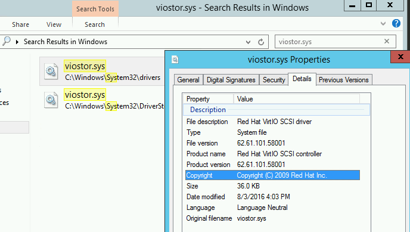

[KVM/QEMU Windows guest drivers (virtio-win)](https://github.com/virtio-win/kvm-guest-drivers-windows)是 KVM/QEMU Windoes guest驱动，同时提供了paravirtual和emulated硬件。

如果需要直接安装二进制驱动程序，可以从 [Fedora Windows Virtio Drivers](https://fedoraproject.org/wiki/Windows_Virtio_Drivers)下载。

从 virtio-win-0.1.103-2 开始支持 [QEMU pvpanic](https://github.com/qemu/qemu/blob/master/docs/specs/pvpanic.txt)

# 如何检查当前已安装virtio-win版本

* 在Windows系统中找到`viostor.sys`文件（`C:\Windows\System32\drivers\viostor.sys`），然后检查`Properties > Details`版本信息

上述版本为 `62.61.101.58001` 则对应的`virtio-win`版本是`virtio-win-0.1.58-1.iso` ?

> 参考[how to find which virtio drivers version is installed in windows?](https://forum.proxmox.com/threads/solved-how-to-find-which-virtio-drivers-version-is-installed-in-windows.16174/)，检查当前已经安装的`virtio-win`驱动的版本第4个字段

# 参考

* [10.2. Installing the Drivers on an Installed Windows Guest Virtual Machine](https://access.redhat.com/documentation/en-us/red_hat_enterprise_linux/6/html/virtualization_host_configuration_and_guest_installation_guide/form-virtualization_host_configuration_and_guest_installation_guide-para_virtualized_drivers-mounting_the_image_with_virt_manager)
* [HOW CAN I UPDATE THE VIRTIO DRIVERS OF MY WINDOWS VM?](https://okeanos.grnet.gr/support/user-guide/cyclades-how-can-i-update-the-virtio-drivers-of-my-windows-vm/)