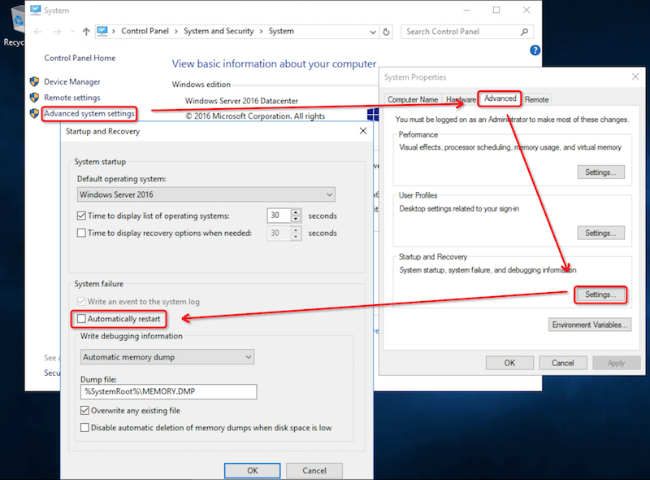
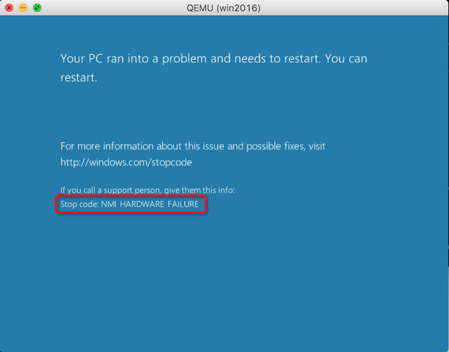

> [Windows pvpanic驱动安装后](windows_pvpanic)，我们需要测试和排查虚拟机crash

# 测试未启用pvpanic设备core dump

首先测试未启用pvpanic设备时候的core dump功能，此时先设置Windows蓝屏时不自动重启，然后通过命令行实现虚拟机内存core dump。

## windows虚拟机关闭蓝屏自动重启（可选）

如果想在蓝屏时候避免Windows默认自动重启，以便有充足时间手工触发一次core dump，则执行以下操作：



## QEMU QMP `inject-nmi`触发蓝屏

QEMU的底层协议 QENU Machine Protocol (QMP)可以通过 libvirt 的 `qemu-monitor-command` 命令访问。QMP指令`inject-nmi`可以触发Windows虚拟机出现一个蓝屏core dump

触发命令如下：

```bash
virsh qemu-monitor-command win2016 --pretty '{"execute":"inject-nmi"}'
```

> 这里`execute`表示执行`inject-nmi`指令（完全是JSON格式），此时就会在Windows虚拟机的VNC桌面看到触发了一个蓝屏。

> 参考 [Multiple ways to access QEMU Machine Protocol (QMP)](https://kashyapc.wordpress.com/2013/03/31/multiple-ways-to-access-qemu-machine-protocol-qmp/)

此时Linux终端返回信息

```
{
    "return": {

    },
    "id": "libvirt-35"
}
```

在VNC上观察可以看到出现蓝屏提示信息：



## 手工获取虚拟机内存core dump

> 这里采用两种方法，一种是通过`virsh`调用直接QMP指令，一种是通过 `virsh dump`方式，对比两者memory dump有什么差异。

* `virsh`调用直接QMP指令，不过，为了能够方便人观察指令，`virsh`提供了一个 `--hmp` 参数来替代JSON格式输入：

```
virsh qemu-monitor-command win2016 --hmp "dump-guest-memory win2016_qmp_dump-guest-memory"
```

参考 [Extracting Windows VM crash dumps](https://ladipro.wordpress.com/2017/01/06/extracting-windows-vm-crash-dumps/) ，这里传递给QMP的指令应该是 `dump-guest-memory paging=false protocol=file:/tmp/win2016_qmp_dump-guest-memory`

```
virsh qemu-monitor-command win2016 --hmp "dump-guest-memory paging=false protocol=file:/tmp/win2016_qmp_dump-guest-memory"
```

但是我这里出现了报错：

```
invalid char 'p' in expression
Try "help dump-guest-memory" for more information
```

根据`help dump-guest-memory`输出的提示，改写成`dump-guest-memory win2016_qmp_dump-guest-memory`。这是因为参数`-p: do paging to get guest's memory mapping.`，而这里似乎不应该使用`paging`，所以去掉`-p`参数。

但是，总是提示`Could not open 'win2016_qmp_dump-guest-memory': Permission denied`。

暂时失败!!!

> 参考 [Unable to execute QEMU command 'dump-guest-memory': dump: failed to save memory](https://bugzilla.redhat.com/show_bug.cgi?id=1481595)可以知道，如果使用pvpanic，实际上也是调用 `dump-guest-memory` 指令：

```
May 14 14:20:02 virt8 libvirtd: 2017-05-14 18:20:02.265+0000: 14365: error : qemuMonitorJSONCheckError:389 : internal error: unable to execute QEMU command 'dump-guest-memory': dump: failed to save memory
```

[Simple virsh commands](https://gist.github.com/archerslaw/9798802) 这篇使用文档写得很简洁实用，可以参考

* 使用`virsh dump`

```
virsh dump --live <domain id> win2016.core --memory-only
```

## 使用Volatility转换

[Volatility](https://github.com/volatilityfoundation/volatility)是一个开源的内存提取工具。不过，请直接从官方网站下载最新版本，发行版的版本过低，无法分析windows 2016系统。

```
python vol.py imageinfo -f XXXXXX.core
```

分析后会给出建议的profile，类似：

```
INFO    : volatility.debug    : Determining profile based on KDBG search...
          Suggested Profile(s) : Win7SP1x64, Win7SP0x64, Win2008R2SP0x64, Win2008R2SP1x64_24000, Win2008R2SP1x64_23418, Win2008R2SP1x64, Win7SP1x64_24000, Win7SP1x64_23418
                     AS Layer1 : WindowsAMD64PagedMemory (Kernel AS)
                     AS Layer2 : QemuCoreDumpElf (Unnamed AS)
                     AS Layer3 : FileAddressSpace (/home/huatai/volatility/i-bp1gbxnafijcszw5f30d)
                      PAE type : No PAE
                           DTB : 0x187000L
                          KDBG : 0xf8000180a0f0L
          Number of Processors : 2
     Image Type (Service Pack) : 1
                KPCR for CPU 0 : 0xfffff8000180bd00L
                KPCR for CPU 1 : 0xfffff880009c5000L
             KUSER_SHARED_DATA : 0xfffff78000000000L
           Image date and time : 2018-06-13 06:32:50 UTC+0000
     Image local date and time : 2018-06-13 14:32:50 +0800
```

```
python vol.py -f XXXXXX.core --profile=Win2008R2SP1x64 raw2dmp -O XXXXXX.dump
```

# 分析

## 准备Windows分析平台

* 安装[Windows Software Development Kit](https://en.wikipedia.org/wiki/Microsoft_Windows_SDK)，可以从微软网站下载[Windows 10 SDK for April 2018 Update](https://developer.microsoft.com/en-us/windows/downloads/windows-10-sdk)。这个SDK提供了最新的头文件，库，元数据和用于构建Windows 10应用程序的工具。

> 也可以单独安装[WinDbg (Debugging Tools for Windows)](https://docs.microsoft.com/en-us/windows-hardware/drivers/debugger/debugger-download-tools)，不过[Windows Software Development Kit](https://en.wikipedia.org/wiki/Microsoft_Windows_SDK)，可以从微软网站下载[Windows 10 SDK for April 2018 Update](https://developer.microsoft.com/en-us/windows/downloads/windows-10-sdk)已经包含了功能相同的WinDbg。

* 启动WindDbg，然后使用菜单``

* 在windbg的file菜单中打开symbol path设置。输入
   
```   
C:\symbols;srv*c:\Symbols*http://msdl.microsoft.com/download/symbols
```

然后可以看到winDbg下载符号表，完成后，就可以进行分析。

* 简单命令
  * `~n` 这里`n`表示cpu编号，例如`~0`切换到cpu 0，`~1`切换到cpu 1
  * `kv` 检查堆栈
  * `.reload` 加载nt符号


# 参考

* [Extracting Windows VM crash dumps](https://ladipro.wordpress.com/2017/01/06/extracting-windows-vm-crash-dumps/)
* [Multiple ways to access QEMU Machine Protocol (QMP)](https://kashyapc.wordpress.com/2013/03/31/multiple-ways-to-access-qemu-machine-protocol-qmp/)