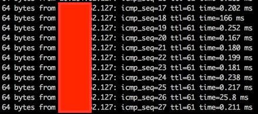
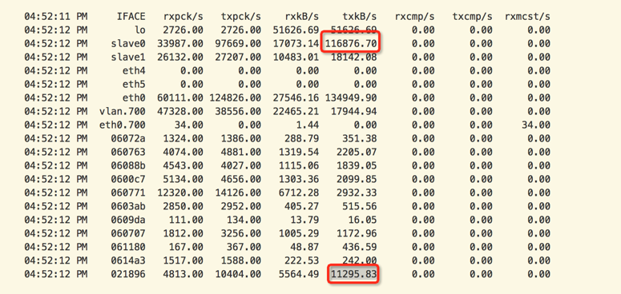
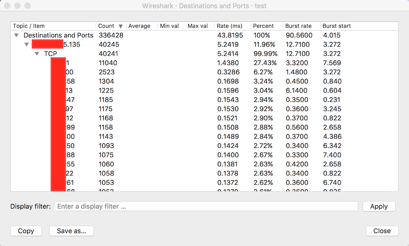

# 快速起步

> 如果你没有耐心看完全文，这里有一个快速起步

* 分钟级别的网络监控有可能会忽略掉很多网络隐患，特别是网络间歇性拥塞（毛刺）可能被分钟级数据采样平滑掉，导致忽略了一些故障问题。
* 当出现ping延迟抖动，对于虚拟机排查，需要确定延迟在物理网络还是虚拟网络，需要在物理服务器、虚拟机上分别对物理网卡、虚拟网络frontend/backend进行tcpdump抓包，根据ICMP echo `icmp_seq`来确定延迟数据包的延迟发生位置

```
tcpdump -n -i eth0 host 192.168.47.111 and icmp
```

* 使用`iftop`对网络流量进行分析，确定在拥塞时候导致网络异常的主要原因。
* 在阿里云混合部署（虚拟化、网络、存储）集群，如果网络拥塞时虚拟网卡流量占比不高，则重点需要排查底层服务流量，分布式存储的网络流量需要重点关注排查。
* 分布式存储的特性是3副本chunkServer，在`tdc/river`存储驱动层限流会有3倍的网络流量放大；当采用bonding双网卡模式时（layer3+4），`Port+IP`的hashing有一定概率网络流量集中到单边网卡，对于重度网络和存储应用，需要做好vm打散和底层限流，使得流量`打爆`不平衡的单边网卡概率降低。
* 强烈推荐使用万兆网络，千兆网络已经难以适应当前迅速发展的业务压力。

# vm ping延迟问题

线上排查两个vm之间ping的延迟问题，从虚拟机内部和虚拟机所在的物理服务器看，`top`显示负载都非常小，同时使用`sar -n DEV 1`看到的网络流量也不高，远没有到达虚拟网络的负载瓶颈。

但是用户反馈，在vm_a 上 ping vm_b 总是会间歇性出现ICMP echo reply响应超过100ms以上



| 源虚拟机 IP | 源虚拟机名 | 虚拟vif | 源NC IP | 目的虚拟机 IP | 目的虚拟机名 | 虚拟vif | 目的NC IP |
| ---- | ---- | ---- | ---- | ---- | ---- | ---- | ---- |
| 192.168.47.111 | vm_a | 023471 | 10.1.16.165 | 192.168.47.127 | vm_b | 061606 | 10.1.16.55 |

> 本文IP地址是修订过模拟地址，仅作为演示

> 有关获取虚拟机`虚拟vif`方法见下文`virsh dumpxml <虚拟机名>`输出部分

# 排查步骤

## 确定抓包接口

* 首先在源物理服务器上找到源虚拟机对应的虚拟网卡

```
$sudo virsh list | grep vm_a
 67    vm_a running
```

通过`virsh dumpxml`查看到虚拟网卡的命名`023471`

```
sudo virsh dumpxml vm_a
```

输出显示

```
      <interface type='bridge'>
        <mac address='00:16:3e:02:34:71'/>
        <source bridge='eth0'/>
        <vport name='cp.023471'/>
        <pps tx='120000'/>
        <target dev='023471'/>
        <model type='virtio'/>
        <driver name='vhost' queues='1'/>
        <alias name='net0'/>
        <address type='pci' domain='0x0000' bus='0x00' slot='0x03' function='0x0'/>
      </interface>
```

同样操作在目的物理服务器上对目的虚拟机执行一次以获得目逆虚拟机的虚拟网卡的名字。


## 在网络链路的物理服务器和虚拟机上执行`tcpdump`抓包

* 源虚拟机`192.168.47.111`内部抓包对端虚拟机`192.168.47.127`IP地址包

```
tcpdump -n -i eth0 host 192.168.47.127 and icmp
```

* 源物理服务器上分别在物理网卡和虚拟机的vif上抓对端虚拟机`vm_a`IP地址包

```
tcpdump -n -i eth0 host 192.168.47.127 and icmp

tcpdump -n -i 023471 host 192.168.47.127 and icmp
```

> `-n`参数可以避免`tcpdump`反向解析IP地址（在大流量网络数据情况下会导致tcpdump大量丢失数据包）
>
> `-i`指定抓包接口，这样可以分别从物理网卡和虚拟网卡上获得时间戳对比确定延迟的阶段
>
> `icmp`表示只捕捉`ICMP`协议，如果要限定只捕捉ICMP echo `request`则设置`-e icmp[icmptype] == 8`；如果只捕捉ICMP echo `reply`则设置`-e icmp[icmptype] == 0`

* 反过来，在目标端，则抓源端IP地址。即在目的虚拟机`192.168.47.127`执行抓源虚拟机IP`192.168.47.111`

```
tcpdump -n -i eth0 host 192.168.47.111 and icmp
```

* 目的物理服务器上分别在物理网卡和虚拟机的vif上抓对端虚拟机`vm_a`IP地址包

```
tcpdump -n -i eth0 host 192.168.47.111 and icmp

tcpdump -n -i 061606 host 192.168.47.111 and icmp
```

* 在源vm上开始ping目标vm的IP地址

```
ping 192.168.47.127
```

# 分析抓包

## 分析思路

* 在源vm上 ping 目的地址，可以知晓出现异常reply时间的ICMP包的`icmp_seq`
* 在整个网络链路上，每个物理网卡和虚拟网卡上都使用tcpdump分析icmp协议，根据上一步的`icmp_seq`查看tcpdump中对应ICMP echo的`request`和`reply`时间戳。
  * 同一个`icmp_seq`在某个接口上如果突然出现和下一个接口时间戳差异极大，则表明网络延迟发生在这两个接口之间网段。

## 网络链路

* 找到ICMP echo 时间超长的包

在长时间`ping`过程中，在源VM上看到`ping`延迟信息显示在第`110`个ICMP echo上：

```
64 bytes from 192.168.47.127: icmp_seq=109 ttl=61 time=0.198 ms
64 bytes from 192.168.47.127: icmp_seq=110 ttl=61 time=120 ms
64 bytes from 192.168.47.127: icmp_seq=111 ttl=61 time=0.493 ms
......
^C
--- 192.168.47.127 ping statistics ---
116 packets transmitted, 116 received, 0% packet loss, time 115943ms
rtt min/avg/max/mdev = 0.195/2.323/120.569/11.938 ms
```

此时终止`ping`并终止网络链路上的`tcpdump`抓包

* 分析网络链路如下

```
eth0 (源VM内FrontEnd) <=> vif 023471 (源物理服务器BackEnd) <=> eth0 (源物理服务器物理网卡) <=> 交换路由网络 
<=> eth0 (目的物理服务器物理网卡) <=> vif (目的物理服务器BackEnd) <=> eth0 (目的VM内FrontEnd)
```

## 各段网络的ICMP时间戳

* eth0 (源VM内FrontEnd)


```
19:53:08.851499 IP 192.168.47.111 > 192.168.47.127: ICMP echo request, id 21616, seq 110, length 64
19:53:08.972053 IP 192.168.47.127 > 192.168.47.111: ICMP echo reply, id 21616, seq 110, length 64
```

reply时间： 08.972053 - 08.851499 = 0.120554 s

* vif 023471 (源物理服务器BackEnd)

```
19:53:08.850975 IP 192.168.47.111 > 192.168.47.127: ICMP echo request, id 21616, seq 110, length 64
19:53:08.971458 IP 192.168.47.127 > 192.168.47.111: ICMP echo reply, id 21616, seq 110, length 64
```

reply时间： 08.971458 - 08.850975 = 0.120483 s

* eth0 (源物理服务器物理网卡)

```
19:53:08.850991 IP 192.168.47.111 > 192.168.47.127: ICMP echo request, id 21616, seq 110, length 64
19:53:08.971440 IP 192.168.47.127 > 192.168.47.111: ICMP echo reply, id 21616, seq 110, length 64
```

reply时间： 09.852337 - 09.852327 = 0.120449 s

* eth0 (目的物理服务器物理网卡)

```
19:53:08.851171 IP 192.168.47.111 > 192.168.47.127: ICMP echo request, id 21616, seq 110, length 64
19:53:08.851255 IP 192.168.47.127 > 192.168.47.111: ICMP echo reply, id 21616, seq 110, length 64
```

reply时间： 08.851255 - 08.851171 = 0.000084 s

* vif (目的物理服务器BackEnd)

```
19:53:08.851188 IP 192.168.47.111 > 192.168.47.127: ICMP echo request, id 21616, seq 110, length 64
19:53:08.851241 IP 192.168.47.127 > 192.168.47.111: ICMP echo reply, id 21616, seq 110, length 64
```

reply时间： 08.851241 - 08.851188 = 0.000053 s

* eth0 (目的VM内FrontEnd)

```
19:53:08.850831 IP 192.168.47.111 > 192.168.47.127: ICMP echo request, id 21616, seq 110, length 64
19:53:08.850846 IP 192.168.47.127 > 192.168.47.111: ICMP echo reply, id 21616, seq 110, length 64
```

reply时间： 08.850846 - 08.850831 = 0.000015 s

* 交换路由网络: 这段未抓包，而是根据两端服务器的物理网卡、虚拟网卡分析推断中间交换路由部分消耗的时间

从源和目的主机抓包ICMP echo实现戳分析，可以看出时间超时时间消耗在物理路由交换网络中`0.120365 s`

eth0 (源物理服务器物理网卡) => eth0 (目的物理服务器物理网卡) 的 ICMP echo request: 08.851171 - 08.850991 = 0.000180 s
eth0 (目的物理服务器物理网卡) => eth0 (源物理服务器物理网卡) 的 ICMP echo reply: 08.971440 - 08.851255 = 0.120185 s

**可以判断上述网络延迟故障发生在物理网络上，并且是`ICMP echo reply`返回数据包时候出现延迟**

# 网络流量分析

前面初步排查分析，排除了虚拟网络导致的延迟，定位到了在物理网络上出现了网络延迟。那么问题来了：究竟是物理服务器网络（卡）的异常还是交换路由网络的异常？

仅仅将问题定位到物理网络实际上包含了整个物理链路，包括两端物理服务器网络和网络数据包经过的所有交换路由设备 -- 分析的道路还很长。。。

通过观察ping延迟时候的网络性能指令

```
sar -n DEV 1
```

可以观察和分析：

* 虚拟网络流量只占整个网络流量的1/10 - 虚拟网卡所有流量累加
* 说明底层服务网络流量是导致网络拥塞的主要原因，这部分流量最主要是分布式存储流量、性能监控、日志流量
* 需要进一步分析物理服务器流量组成，以定位root cause



## 网络协议分析

理论上来说，我们可以使用`tcpdump`来分析所有的网络流量，但是靠手工抓取数据包，然后传输到wireshark中分析效率非常低，且不能实时处理。而靠肉眼去观察`tcpdump`提取的摘要信息分析，对于海量数据也不可能。

根据协议（端口）进行网络流量分析，有一种方式是通过计算`pcap`捕获的数据包进行协议分析计算，主要工具有：

* TCPTrack - 这个工具已经停止开发，但是这是一个非常简单的数据包统计工具，可以通过源代码编译安装
* [ntop](http://www.ntop.org/) - 依然在活跃开发的数据包分析工具，并且形成了完整的生态系统（已经不是多年前一个简陋的web分析工具了）
* [iftop](http://www.ex-parrot.com/pdw/iftop/) - 非常高效简洁的终端网络协议统计分析工具，强烈推荐

## `iftop`分析

在上述定位到网络延迟发生在物理服务器底层服务，我们需要通过网络流量分析来找出导致网络拥塞的具体原因。`iftop`是服务器端统计分析网络流量的强大工具 - 详细使用方法见 [服务器网络流量实时统计分析利器iftop](../../../network/packet_analysis/utilities/iftop)

简单使用方法是采用如下命令，分别在两个物理网卡上捕捉并统计分析服务器之间网络流量。由于`iftop`能够显示网络端口，这样通过`IP+Port`方式，就能够在网络拥塞故障发生时找到导致异常的root case:

```
iftop -n -N -P -B -i eth0
iftop -n -N -P -B -i eth1
```

并排展示两个网卡的实时网络流量，辅助以ping包检查网络抖动，在网络抖动时观察网络流量并分析主机和协议端口，定位故障原因。

以下是`iftop`的一个演示截图，非故障当时网络流量，仅供了解`iftop`功能的参考


## wireshark（备用参考）

通过服务器tcpdump捕捉的数据包转储文件，可以在wireshark中加载，并利用wireshark强大的分析和统计功能来找寻root cause。

**著名网络协议分析软件**不用介绍了吧？：[维基百科：Wireshark](https://zh.wikipedia.org/zh-cn/Wireshark)

WireShark具有非常强大的分析功能，针对故障排查统计，有两个分析功能非常好：（更多统计功能可以探索`Statistics`菜单）：

* `Statistics => IPv4 Statistics => Source and Destination Addresses` - 按照IP地址的源和目标进行分类统计（实际是分别统计的），统计以后可以按照`Count`排序，这样就能轻易找出抓包中哪些IP地址间数据包数量最多，以及占总数的百分比


* `Statistics => IPv4 Statistics => Destinations and Ports` - 分析数据包的目标IP地址和端口，这样就能够分辨出网络协议的占比



### Wireshark测量

### 分析网络流量

* 使用`editcap`工具切片抓包的`pcap`文件

先不断循环抓包(每10秒循环一次，保留3个文件：`-W 3 -G 10`)：

```
tcpdump -s 0 -i eth0 -nn -xX -w network-%Y-%M-%d_%H:%M:%S.pcap -W 3 -G 10 host 10.1.23.191
```

> `tcpdump`需要较高版本才支持`-G`循环参数，早期版本不支持按时间进行循环的参数，但是可以组合使用`-c 1000`表示抓1000个数据包，或者组合使用`-C 100`表示抓100MB数据包进行循环，例如：

```
tcpdump -s 0 -i eth0 -nn -xX -w network-%Y-%M-%d_%H:%M:%S.pcap -W 3 -C 100 host 10.1.23.191
```

> 不过低版本循环似乎总是会报错误`tcpdump: network-%Y-%M-%d_%H:%M:%S.pcap0: Permission denied`，暂时放弃，实际还是手工控制

```
tcpdump -s 0 -i eth0 -nn -xX -w network.pcap host 10.1.23.191
```

既然我们知道毛刺网络流量发生的时间点，假设时间点是`01:47:21 ~ 01:47:21` 这1秒钟，则切片命令如下

```
editcap -F libpcap -A "2017-04-26 01:47:21" -B "2017-04-26 01:47:21" network.pcap output.pcap
```

> `editcap`属于`wireshark`工具包

由于这个时间点切片下来数据量相对较少，则尝试使用`tcptrack`分析

```
tcptrack -T output.pcap > output.txt
cat output.txt
```

# 参考

* [Tcpdump: How to to capture only ICMP (ping) echo requests](https://forum.ivorde.com/tcpdump-how-to-to-capture-only-icmp-ping-echo-requests-t15191.html)
* [Measuring Bandwidth using Wireshark](http://blog.davidvassallo.me/2010/03/22/measuring-bandwidth-using-wireshark/)
* [Filter a pcap dump file for a specific time range](http://stackoverflow.com/questions/19952991/filter-a-pcap-dump-file-for-a-specific-time-range)
* [tcpdump - rotate capture files using -G -W and -C](https://superuser.com/questions/904786/tcpdump-rotate-capture-files-using-g-w-and-c)

