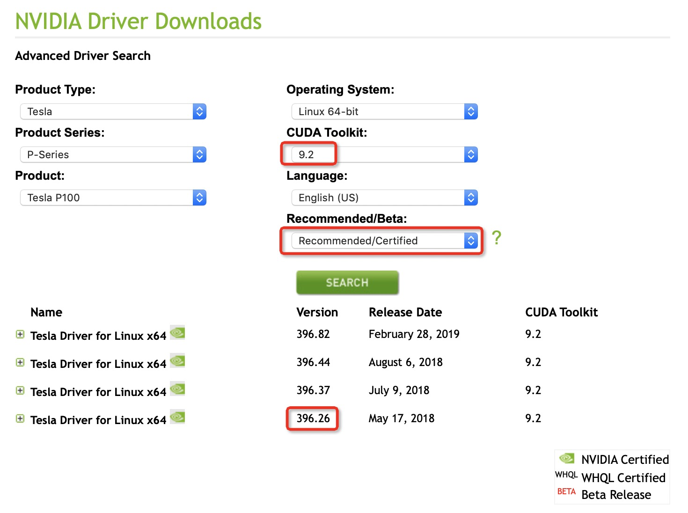

# 检查

* 使用 `lspci | grep -i nvidia`

> 不过，不知道为何Telsa P100显卡显示为 `05:00.0 3D controller: NVIDIA Corporation Device 15f8 (rev a1)`

通过命令 `lspci -vnnn` 可以看到详细信息，可以看到服务器上安装了两块Nvidia显卡

```
05:00.0 3D controller [0302]: NVIDIA Corporation Device [10de:15f8] (rev a1)
	Subsystem: NVIDIA Corporation Device [10de:118f]
	Physical Slot: 0-3
	Flags: bus master, fast devsel, latency 0, IRQ 198
	Memory at c6000000 (32-bit, non-prefetchable) [size=16M]
	Memory at 383800000000 (64-bit, prefetchable) [size=16G]
	Memory at 383c00000000 (64-bit, prefetchable) [size=32M]
	Capabilities: [60] Power Management version 3
	Capabilities: [68] MSI: Enable+ Count=1/1 Maskable- 64bit+
	Capabilities: [78] Express Endpoint, MSI 00
	Capabilities: [100] Virtual Channel
	Capabilities: [250] Latency Tolerance Reporting
	Capabilities: [258] L1 PM Substates
	Capabilities: [128] Power Budgeting <?>
	Capabilities: [420] Advanced Error Reporting
	Capabilities: [600] Vendor Specific Information: ID=0001 Rev=1 Len=024 <?>
	Capabilities: [900] #19
	Kernel driver in use: nvidia

84:00.0 3D controller [0302]: NVIDIA Corporation Device [10de:15f8] (rev a1)
	Subsystem: NVIDIA Corporation Device [10de:118f]
	Physical Slot: 0-6
	Flags: bus master, fast devsel, latency 0, IRQ 199
	Memory at f9000000 (32-bit, non-prefetchable) [size=16M]
	Memory at 387800000000 (64-bit, prefetchable) [size=16G]
	Memory at 387c00000000 (64-bit, prefetchable) [size=32M]
	Capabilities: [60] Power Management version 3
	Capabilities: [68] MSI: Enable+ Count=1/1 Maskable- 64bit+
	Capabilities: [78] Express Endpoint, MSI 00
	Capabilities: [100] Virtual Channel
	Capabilities: [250] Latency Tolerance Reporting
	Capabilities: [258] L1 PM Substates
	Capabilities: [128] Power Budgeting <?>
	Capabilities: [420] Advanced Error Reporting
	Capabilities: [600] Vendor Specific Information: ID=0001 Rev=1 Len=024 <?>
	Capabilities: [900] #19
	Kernel driver in use: nvidia
```

实际安装了nvidia驱动之后，使用 `nvidia-smi -a` 可以检查详细的设备信息

```
GPU 0000:05:00.0
    Product Name                    : Tesla P100-PCIE-16GB
...
```

# 下载

* 从 [Nvidia官方驱动下载](https://www.nvidia.com/Download/Find.aspx) 选择对应的驱动



> 注意：选择CUDA Toolkit 版本为9.2 并选择 Recommanded/Certified 才能选择需要的稳定版本。例如，我下载的 `NVIDIA-Linux-x86_64-396.26.run`

> 注意：通常新版本驱动是兼容旧版本cuda的，但是不能保证激活最新的功能，所以请参考官方 [CUDA Compatibility](https://docs.nvidia.com/deploy/cuda-compatibility/index.html) 文档。

# 安装

* 安装驱动

```
sudo bash NVIDIA-Linux-x86_64-396.26.run
```

安装提示

```
ERROR: An NVIDIA kernel module 'nvidia-uvm' appears to already be loaded in your kernel.  This may be because it
         is in use (for example, by an X server, a CUDA program, or the NVIDIA Persistence Daemon), but this may
         also happen if your kernel was configured without support for module unloading.  Please be sure to exit any
         programs that may be using the GPU(s) before attempting to upgrade your driver.  If no GPU-based programs
         are running, you know that your kernel supports module unloading, and you still receive this message, then
         an error may have occured that has corrupted an NVIDIA kernel module's usage count, for which the simplest
         remedy is to reboot your computer.

 ERROR: Installation has failed.  Please see the file '/var/log/nvidia-installer.log' for details.  You may find
         suggestions on fixing installation problems in the README available on the Linux driver download page at
         www.nvidia.com.
```

检查内核模块可以看到 `nvidia_uvm` 被两次引用无法卸载

```
#lsmod | grep nvidia
nvidia_uvm            743489  2
nvidia_drm             52986  0
nvidia_modeset        790163  1 nvidia_drm
nvidia              11944297  98 nvidia_modeset,nvidia_uvm
drm_kms_helper        125056  3 ast,nouveau,nvidia_drm
drm                   349210  6 ast,ttm,drm_kms_helper,nouveau,nvidia_drm
i2c_core               40582  8 ast,drm,igb,i2c_i801,drm_kms_helper,i2c_algo_bit,nvidia,nouveau
```

解决方法是先停止使用GPU的容器

# 参考

* [How to install Nvidia driver on CentOS 7 Linux](https://www.cyberciti.biz/faq/how-to-install-nvidia-driver-on-centos-7-linux/)