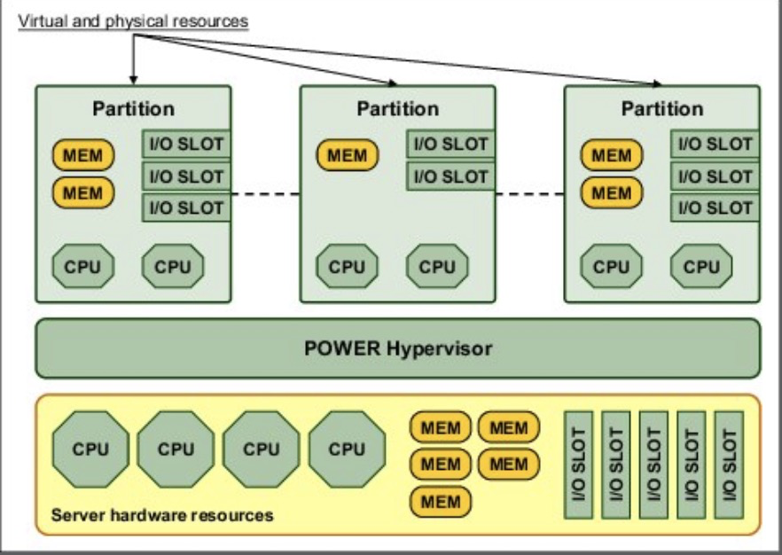
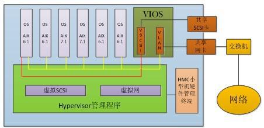

PowerVM服务器虚拟化允许将一个物理服务器分成多个安全的虚拟服务器，可帮助降低硬件购买成本和管理成本。

> PowerVM虚拟化有3种版本，其中Express版本可以虚拟出3台服务器（但是只能体验，缺乏迁移和suspend/resume等必要虚拟化功能），企业版则可以虚拟1000台服务器。

PowerVM的虚拟化功能的一个概念是"工作负载分区"（Workload Partition）。

# Power Hypervisor

Power Hyperisor是PowerVM的关键技术，提供了将物理系统资源划分成多个独立且隔离的逻辑分区。每个逻辑分区操作就像一个独立的运行自己操作系统的主机：AIX，Linux或Virtual I/O Server。Hypervisor可以分配隔离的处理器，I/O和内存，可以按需动态分配到每个逻辑分区。

Hypervisor也可以分配逻辑分区共享的处理器用于微分区功能（micro-partition)。Hypervisor创建一个共享的处理器池，并按需分配虚拟机处理器给逻辑分区。

POWER Hypervisor 提供以下功能：

* 在逻辑分区(Logical partitions, LPARs)间提供一个安全层增强分区完整可靠
* 提供物理硬件资源和逻辑分区使用物理资源的一个抽象层，控制了虚拟机处理器到物理处理器的映射和管理，并且提供在不同虚拟机处理器之间切换的处理器状态保存和恢复
* 控制硬件I/O中断和管理分区能力

# PowerVM VIOS

虚拟I/O服务器(Virtual I/O Server，VIOS)是PowerrVM的特定用途的一个分区，用来给分区提供虚拟I/O资源。VIOS拥有与分区共享的资源，分给VIOS分区的物理适配器可以由一个或多个分区共享，这样多个分区就不需要专用的网络适配器、磁盘适配器、磁盘驱动器以及磁带设备等，即VIOS可以降低成本。

> 我的理解是VIOS是一个对外提供存储服务、网络服务的特殊虚拟机，PowerVM可能采用了分布式存储结构，VIOS是分布式存储的存储服务端所在的虚拟机。VIOS可能也集成了网络卸载，类似VXLAN的XGW功能。

## 虚拟SCSI

vSCSI在VIOS上提供虚拟的SCSI把链接的磁盘卷提供给客户机LPAR

> 我的理解是VIOS管控了物理主机的磁盘卷，然后在VIOS这个特殊分区中启动了iSCSI的target服务，提供给其他LPAR使用，这样其他的普通LPAR就只需要运行iSCSI client就可以直接访问VIOS提供的SCSI存储设备。

# 内存虚拟化

PowerVM在分区分配内存可以采用动态（共享）分配和专用分配。

# CPU虚拟化

微分区允许虚拟分区只占用一部分CPU资源，最细的颗粒度可以是一个CPU核心的1/10。

> Intel的x86体系中，vcpu对应的是处理器核心的HT，常规的Intel处理器每个核心大约支持4～8个HT，可能类似IBM的这个CPU的核心细粒度。

PowerVM的共享处理器逻辑分区可以在微分区基础上，通过一种称为 `未封顶分区` 的特性来扩大CPU数量，允许系统在突发的CPU密集时期，从共享的处理器池的其他逻辑分区中分配未使用的CPU资源。CPU资源的调整单位可精细到1/100核心，方便精确性管理。

> 在Intel KVM虚拟化中，虚拟机共享CPU资源情况下，可以通过cgroup来划分虚拟机进程可以使用的资源，在突发情况下保障高优先级虚拟机的运行。KVM虚拟机可分配的vcpu数量可以动态调整，但我还没有看到自动化实现。目前看KVM虚拟化可以通过cgroup来限制实际的物理CPU百分比，但vcpu数量动态调整不知道有没有必要。

# 逻辑分区和动态逻辑分区

PowerVM支持逻辑分区(logical patitions, LPARs)和动态逻辑分区(dynamic logical partitions,DLPARs)。动态逻辑分区可以在负载突发增长或降低情况下动态创建或销毁逻辑分区。

> PowerVM的逻辑分区类似于结合了KVM虚拟化的云计算管控系统，例如OpenStack或者AWS都提供了弹性伸缩方式来按需创建和销毁虚拟机。PowerVM在单台大型机上实现这种技术。

# 分区迁移

## 动态分区迁移

动态分区迁移 (Live Partition Mobility) 可以实现运行状态的AIX和Linux分区从一台物理服务器迁移到另一个物理服务器，不中断分区运行，保持系统事务完整性。迁移操作将传输整个系统环境，包括处理器的状态、内存、附加的虚拟设备，以及连接的用户。

## 静态分区迁移

静态迁移：也叫做常规迁移、离线迁移(Offline Migration)。就是在虚拟机关机或暂停的情况下从一台物理机迁移到另一台物理机。

# 参考

* [IBM PowerVM Virtualization Introduction and Configuration](https://www.redbooks.ibm.com/abstracts/sg247940.html?Open)
* [解析IBM虚拟化技术原理 探索测试快速化道路](https://cloud.tencent.com/info/8b3b475641d18231029cd306d59b1c90.html)