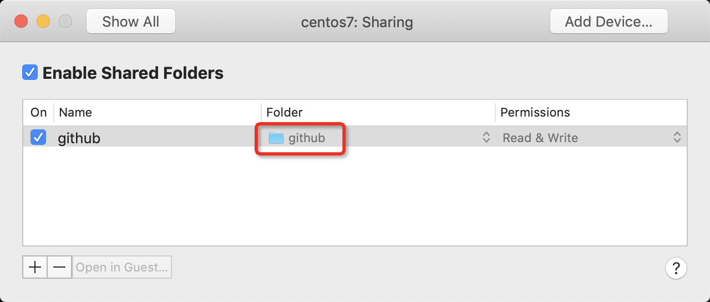

# VMware Tools

VMware Tools是用于增强虚拟机的Guest操作系统性能并改进虚拟机管理的使用程序套件。安装VMware Tools可以改进：

* 视频分辨率低
* 色深不足
* 网速显示错误
* 鼠标移动受限
* 不能复制、粘贴和拖放文件
* 没有声音
* 提供创建客户机操作系统静默快照的能力
* 将客户机操作系统中的时间与主机上的时间保持同步

VMware Tools 包括以下组件：

* VMware Tools 服务
* VMware 设备驱动程序
* VMware 用户进程
* VMware Tools 控制面板

VMware Tools 以下列格式提供：

* ISO（包含安装程序）：它们随产品一起打包并以多种方式进行安装。VMware Tools 为每种支持的客户机操作系统类型提供不同的 ISO 文件：Mac OS X、Windows、Linux、NetWare、Solaris 和 FreeBSD。
* 操作系统特定软件包(OSP)：VMware 为特定 Linux 分发包版本构建和提供可下载的二进制软件包。OSP 通常针对早期版本提供，如 RHEL 6。Linux 的大多数当前版本都包含 Open VM Tools，无需单独安装 OSP。
* Open VM Tools(OVT)：它是面向 Linux 分发包维护人员和虚拟设备供应商的 VMware Tools 开源实施。OVT 通常包含在常见 Linux 分发包的当前版本中，允许管理员与 Linux 软件包一起轻松安装和更新 VMware Tools。

# 使用YUM安装（推荐）

现在发行版已经包含了vmware tools

```
yum install open-vm-tools
```

# 使用RPM安装

> 注意：如果Linux发行版不是基于RPM，使用自定义内核，或者是不提供RPM安装程序的ESX(i) 4.1/5.x，则采用编译方式安装。（见下文）

* 启动Linux虚拟机
* VMware的虚拟机管理界面，点击 `客户机 > 安装/升级 VMware Tools`，然后单击`确定`
* 在虚拟机内部创建挂载点，并挂在CDROM

```
mkdir /mnt/cdrom
mount /dev/cdrom /mnt/cdrom
```

* 执行以下命令使用RPM安装VMware Tools:

```
rpm -ivh /mnt/cdrom/VMwareTools-version.rpm
```

> 其中 <version> 是要安装的 VMware Tools 的版本

* 要为运行的内核配置VMware Tools，执行以下命令：

```
/usr/bin/vmware-config-tools.pl
```

* 卸载CDROM

```
umount /mnt/cdrom
```

* 结束 VMware Tools 安装，请在虚拟机菜单中单击虚拟机，然后单击客户机 > 结束 VMware Tools 安装。

# 通过编译方式在Linux虚拟机中安装VMware Tools

> [最小化安装CentOS之后安装必要编译工具](。。/。。/os/linux/redhat/package/yum_after_mini_install)

* 启动Linux虚拟机
* VMware的虚拟机管理界面，点击 `客户机 > 安装/升级 VMware Tools`，然后单击`确定`
* 在虚拟机内部创建挂载点，并挂在CDROM

```
mkdir /mnt/cdrom
mount /dev/cdrom /mnt/cdrom
```

* 将VMware Tools源代码包复制到本地，并解压缩：

```
cp /mnt/cdrom/VMwareTools-10.3.2-9925305.tar.gz ~/
tar xfz VMwareTools-10.3.2-9925305.tar.gz
```

* 进入`vmware-tools-distrib`目录然后运行`vmware-install.pl`安装：

```
cd vmware-tools-distrib
./vmware-install.pl
```

这里回答一些问题，默认答复就可以，不过，会在一个搜索内核头文件时候报错：

```
Enter the path to the kernel header files for the 3.10.0-957.1.3.el7.x86_64 kernel?

INPUT: [] default

The path "" is not a valid path to the 3.10.0-957.1.3.el7.x86_64 kernel headers.
Would you like to change it? [yes]
```

但是，虽然系统已经安装了 `kernel-headers` ，但是这里输入路径 `/usr/include/linux` 总是提示错误。

解决方法参考 [vmware + centos 7安装vmtools时提示The path "" is not a valid path to the 3.10.0-327.el7.x86_64 kernel h](https://blog.csdn.net/li_001/article/details/53171037) :

* 先安装 kernel-devel

```
yum -y install kernel-devel-$(uname -r)
```

* 然后针对 `./vmware-install.pl` 的答复问题，将路径答复写成如下内容：

```
Enter the path to the kernel header files for the 3.10.0-957.1.3.el7.x86_64 kernel? 

/lib/modules/3.10.0-957.1.3.el7.x86_64/build/include
```

此时脚本就会提示输入正确了：

```
The path "/lib/modules/3.10.0-957.1.3.el7.x86_64/build/include" appears to be a valid path to the 3.10.0-957.1.3.el7.x86_64 kernel headers.
Would you like to change it? [no]
```

这里直接回撤，表示不再修改就可以正常编译了。

其他提示：

```
The vmxnet driver is no longer support to kernel 3.3 and greater. Please upgrade to a newer virtual NIC. (e.g., vmxnet3 or e1000e)

The vmblock enables dragging or copying files between host and guest in a Fusion or Workstation virtual environment. Do you wish to enable this feature?
[yes]
```

注意：系统需要安装fuse才能支持VMware blocking filesystem

```
NOTICE: It appears your system does not have the required fuse packages installed. The VMware blocking filesystem requires the fuse package and its libraries to function properly. Please install fuse or fuse-utils package using your system package management utility and re-run this script in order to enable the VMware blocking filesystem.
```

安装fuse

```
yum -y install fuse fuse-libs
```

不过，安装fuse之后一定要执行一次加载fuse内核模块，否则依然会提示相同找不到fuse错误

```
modprobe fuse
```

然后重新执行上述脚本

```
VMware automatic kernel modules enable automatic building and installation of VMware kernel modules at boot that are not already present. This feature can be enabled/disabled by re-running vmware-config-tools.pl.

Would you like to enable VMware automatic kernel modules?
[yes]
```

如果没有安装X系统，以后要激活的话使用如下方法：

```
1. Manually start /usr/bin/vmware-user
2. Log out and log back into your desktop session
3. Restart your X session.
```

# 文件系统共享

安装了VMware Tools之后，最方便的是提供了Host主机文件目录共享给Guest的方便方法：



此时登录到虚拟机，可以看到挂载目录：

```
vmhgfs-fuse     234G  212G   22G  91% /mnt/hgfs
```

在 `/mnt/hgfs` 下，就是host主机上的 `github` 共享目录，包含了host主机上共享`github`目录下的所有子目录。

# 参考

* [VMware Tools 概述 (340)](https://kb.vmware.com/s/article/340?lang=zh_CN)
* [使用 Red Hat Package Manager (RPM) 在 Linux 虚拟机中安装 VMware Tools (1018392)](https://kb.vmware.com/s/article/1018392?lang=zh_CN)
* [使用编译器在 Linux 虚拟机中安装 VMware Tools (1018414)](https://kb.vmware.com/s/article/1018414?lang=zh_CN)