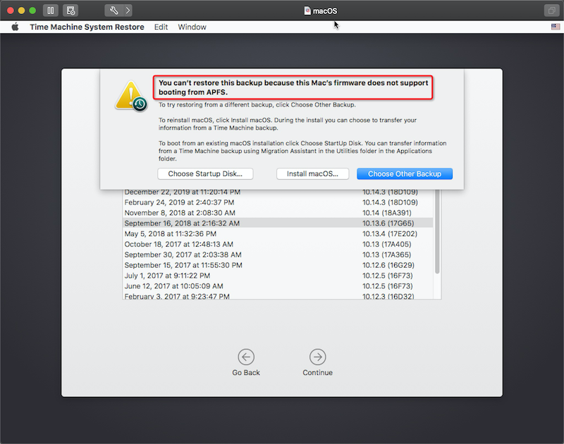

最近在VMware Fustion的虚拟机中，尝试通过Time Machine备份恢复macOS High Sierra版本(10.13.x)，但是原先操作系统已经启用了apfs系统，结果发现提示:

```
You can't restore this backup because this Mac's firmware does not support booting from APFS.
```



从macOS High Sierra开始，macOS提供了一个Apple File System(APFS)用于加速SSD存储，但是MVware UEFI并不支持从APFS的启动分区启动。此时需要让VMware UEFI只想APFS以及能够从macOS installer中解压出APFS驱动作为UEFI驱动扩展。[Using Apple File System (APFS) with your virtualized Mac](https://licson.net/post/vmware-apfs/)提供的思路就是把驱动加载到VMware的UEFI BIOS。

需要3个工具来修改VMWare UEFI BIOS:

* [The APFS UEFI Driver extract](https://github.com/darkhandz/XPS15-9550-Sierra/blob/master/CLOVER-Install/drivers64UEFI/apfs.efi?raw=true)
* [UEFITool, a tool for editing UEFI BIOS](https://github.com/LongSoft/UEFITool/releases)
* [FFS to convert the APFS driver to UEFI module](https://github.com/pbatard/ffs/releases)

并且[Using Apple File System (APFS) with your virtualized Mac](https://licson.net/post/vmware-apfs/)还提供了直接修改好的[modified UEFI BIOS](https://store.licson.net/share/efi64_apfs.rom)，不过我在VMware Fusion 11.5.1上测试没有成功。

> 由于我在TimeMachine中找到了没有使用APFS的备份快照，所以这个实践我没有进行下去。仅做记录。

# 参考

* [Using Apple File System (APFS) with your virtualized Mac](https://licson.net/post/vmware-apfs/)
* 在 [Convert a Physical Mac into a VM Guest under VMware Fusion 5](http://fortysomethinggeek.blogspot.com/2013/03/convert-physical-mac-into-vm-guest.html) 中介绍了如何迁移物理Mac到VMware虚拟机中，可以参考