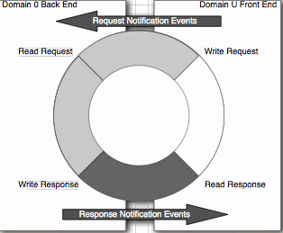
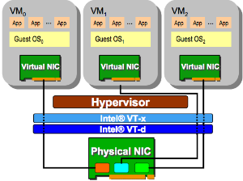
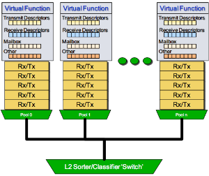

>  Amazon的VPC虚拟机有一个和ECS2 Classic不同的关键性能点是在VPC实例提供了[增强网络](http://docs.aws.amazon.com/AWSEC2/latest/UserGuide/enhanced-networking.html)功能，通过 single root I/O virtualization(SR-IOV) 实现了高I/O性能和低CPU利用率，以及较高的每秒数据包（PPS）性能和低网络延迟：

* Intel 82599 Virtual Function(VFS)接口： 支持实例的 10Gbps
* 伸缩网卡（Elastic Network Adapter, ENA）支持实例最高 20Gbps

netflix测试了Amazon VPC实例，(r3,i2,m4).8xlarge VPC instances能够达到比较小规格EC2经典实例（限流是20w PPS）大约10倍包处理性能，即达到200w PPS。部分应用在VPC下可以达到10倍的RPS（Request/sec）。

以前在Amazon EC2经典网络实例上，Netflix服务是通过RPS速率作为度量来伸缩ASG(Auto Scaling Group)，常规地提供计算牧场来客服Xen拆分驱动模型中固有的数据包处理开销：

> 由于guest端和host端的驱动分为front和backend，导致数据包传递映射有极大性能开销。

> `注意`： EC2 classic instances 和 `低端` VPC 都是使用 Xen split driver model (软件方式)在实例和Dom 0（Xen trusted domain）间共享内存来交换数据包。这个模式在较高的数据包处理时开销大于SR-IOV(硬件方式)增强网卡。

Amazon VPC 承诺在毫秒级别延迟下较高的PPS速率并且意味着较少的实例（节约成本）就可以满足上游服务需求。

# 技术概览

Amazon Enhanced Networking功能是建立在SR-IOV（PCI-SIG标准）技术上，允许实例直接访问物理网卡的PCI资源子集。和Xen虚拟化驱动不同，在云实例中符合SR-IOV的驱动可以DMA（Direct Memory Access）访问NIC硬件来达到交较高的带宽和较低的延迟。

从设备发出直接到虚拟机内存的DMA操作不能保证对底层硬件按的安全。Intel IO虚拟化技术（vt-d）支持DMA和中断重映射，并且限制网卡硬件的物理内存`子集`分配给部分虚拟机。在这个中断处理过程中不需要hypervisor介入。

EC2 classic instance可以有一个Xen虚拟网卡，然而，VPC实例可以支持每个实例多个网卡来帮助分散中断和网络流量。在AWS实例中的虚拟网卡（ENI）被分配给一个PCI虚拟功能（pci virtual function, VF）。每个虚拟功能（物理功能PF的轻量级版本）可以得到物理网卡PCI资源的一个子集： pci 配置寄存器， iomem regions, queue pairs (RX/TX队列)，具有DMA功能的发送和接收描述器集合。

在虚拟机实例中运行的网卡驱动（`ixgbevf`）是半虚拟化（这里的半虚拟化意思是驱动已经被修改只提供有限的pci功能），可以直接向硬件传输数据包，但是不能修改MAC地址，reset设备，或者执行有全局影响的指令。VF驱动依赖运行在特权域（Dom 0）的PF驱动（Physical Function）。在VF和PF驱动间通讯是通过特殊的称为Mailbox的硬件寄存器和缓存实现的。

Intel PCIe 网卡是一个多队列设备。AWS给每个虚拟网卡（ENI，或称为VF）分配`2`个队列对（最多每个实例分配16个队列对）来分散网络流量。每个队列对被pin到一个独立的CPU来支持中断和数据包处理。NIC会哈希(hash)元组(tuple)（srcIP, dstIP, srcPort, dstPort）来决定使用哪个Rx队列（每个虚拟网卡有2个RX队列）用于进入数据流。从一个单一数据流的数据包会始终使用同一个Rx队列以避免数据包重新排序。每个队列对（queue pair）有子集的Tx和Rx描述符（最大4096）集合。在队列中的每个Rx/Tx描述符使用DMA方式存取网卡的单独数据包。当所有Rx/Tx描述符被耗尽或正在使用，NIC驱动就会对网络堆栈进行流量控制。所以更大的Rx描述符可以提高PPS速率和带宽。

Intel PCIe NIC有一个嵌入式二层交换机用户基于目标MAC地址或vlan tag来排序数据包。当发现匹配数据包，就会把数据包转发到相应的队列对。二层交换机也在硬件层执行VF之间的网桥功能，无需hypervisor参与。所以在相同物理服务器上的多个实例因为网卡的网桥功能，就可以比跨越物理主机的网络更低的延迟互相通讯。

> Amazon EC2 有一个称为[Placement Groups](http://docs.aws.amazon.com/AWSEC2/latest/UserGuide/placement-groups.html)的部署方式，将一组实例部署在一个单一的可用区域，这个逻辑分组是为了降低网络延迟。

# Netflix测试Amazon VPC概述

* 在8xlarge实例中测得大约 240w pps，较小的4xlarge大约 100w pps

> 实际测试需要考虑数据包大小，看Netflix测试使用了 `68字节`(iperf)和`64字节`(pktgen) 的小数据包

## 网络测试

* 网络测试工具
  * DPDK测试工具[pktgen-dpdk](http://dpdk.org/download)
  * [iperf](https://iperf.fr/)

| Micro Benchmark |	Network PPS Rates | Protocol |
| ---- | ---- | ---- |
| iperf | 2 Mpps | TCP |
| pktgen | 1.6 Mpps | UDP |

## 应用测试

### Web测试

* 应用测试工具 - [wrk - a HTTP benchmarking tool](https://github.com/wg/wrk)

Nginx web服务器支持socket选项[SO_REUSEPORT](https://lwn.net/Articles/542629/)可以通过降低多个服务进程/线程处理连接时候切换消耗（惊群效应）来提高性能。

在VPC 8xlarge实例压测得到延迟2-5ms 90%的情况下100w RPS，这个性能大约是EC2经典实例的10倍。（此时100w RPS已经达到了底层物理网卡的流量极限无法再推出更多web流量）。

> [聂永的博客: Tsung笔记之开篇](http://www.blogjava.net/yongboy/archive/2016/07/22/431291.html) 推荐了基于Erlang开发的并发压测工具 [Tsung](http://tsung.erlang-projects.org/) 可以支持集群高性能分布式压力测试工具，支持可编程的情景化测试方案。

#### `SO_REUSEPORT`

> 有关`SO_REUSEPORT`选项对网络性能的提升可以参考[SO_REUSEPORT学习笔记](http://www.blogjava.net/yongboy/archive/2015/02/12/422893.html)和[Linux中SO_REUSEADDR和SO_REUSEPORT区别](http://blog.qiusuo.im/blog/2014/09/14/linux-so-reuseport/)。

在StakOverflow有一篇详细的多操作系统`SO_REUSEADDR`和`SO_REUSEPORT`对比 - [Socket options SO_REUSEADDR and SO_REUSEPORT, how do they differ? Do they mean the same across all major operating systems?](http://stackoverflow.com/questions/14388706/socket-options-so-reuseaddr-and-so-reuseport-how-do-they-differ-do-they-mean-t)

简单的概述：

常规的五元组（协议、源地址、源端口、目的地址、目的端口）可以`唯一定位`一个连接，通过 socket, bind, connect 三个系统调用可以为一个socket分配五元组。

Linux内核3.9开始支持`SO_REUSEPORT`选项，在 `bind` 系统调用前，指定了 `SO_REUSEPORT` ，多个 `socket` 便可以 `bind` 到相同的源地址、源端口。为了防止 **端口劫持** ，在第一个 `socket bind` 成功后，后续的 `socket bind` 的用户必须或者是 `root`，或者跟第一个 `socket` 用户一致。

`SO_REUSEPORT`避免了以下两种常见的网络连接开销：

* 父进程绑定一个端口监听 socket ，然后 fork 出多个子进程，子进程们开始循环 accept 这个 socket。监听进程都会被唤醒，但是只有一个进程 accept 成功导致惊群效应。（2.6.18 以后，这个问题得到修复，仅有一个进程被唤醒并 accept 成功）
* `多进程+多路IO复用(epoll)` 的并发模型: 由于 `fork` 文件描述符继承的缘故，所有进程中的 `accept socket fd` 是相同的。惊群效应依然存在。

`SO_REUSEPORT`由于没有采用 fork 的形式，各个进程中的 `accept socket fd` 不一样，加之有新连接建立时，内核只会唤醒一个进程来 `accept`，并且保证唤醒的 **均衡性** ，因此使用 epoll 监听读事件，就不会触发所有。

因此使用 SO_REUSEPORT ，可以在多进程网络并发服务器中，可以充分利用多核的优势。

> 注意：多核环境下使用`SO_REUSEPORT`也并不能线性性能增长。

### Memcached测试

[mcblaster](https://github.com/fbmarc/facebook-memcached-old/tree/master/test/mcblaster)用于生成memcached服务器的负载。

Netflix测试VPC实例大约是1~10ms延迟下 30w RPS(gets/sec)，对比Classic EC2性能是9w RPS。

----

# Linux网络堆栈

Linux内核调优可以实现更高的PPS性能：

* RPS/RFS 网络堆栈功能可以将网络堆栈处理分担到多个处理器上降低延迟，特别是在numa服务器上。
* 如果网卡驱动支持 multi-send 或者 [bulk packet transmission](https://lwn.net/Articles/615238/) ，网络堆栈就可以在传输数据包给网卡驱动之前先在队列中存储多个数据包（skb）。
* 现代网卡支持多Rx/Tx硬件队列可以将每个队列指派个独立的CPU来处理中断。接收流量可以分散到多个Rx队列以充分利用网卡潜能。
* 网卡驱动可以结合使用软件和硬件特性在每个中断处理多个数据包：[NAPI](http://lwn.net/2002/0321/a/napi-howto.php3)和硬件中断减轻功能，用于降低中断处理开销（overhead）。
* 配置每个实例多个虚拟网卡可以将网络中断和数据包处理分担到跟多cpu。多个虚拟网卡也可以用于对服务分离网络流量来提高可访问性。

> [bulk packet transmission](https://lwn.net/Articles/615238/)有一篇中文[[翻译] Bulk network packet transmission](http://www.cnblogs.com/zhangzl2013/p/bulk_network_packet_transmission.html)：内核3.18开始支持`bulk dequeue`，在有数据包需要传输是，网络栈会尽量在获得锁之后一次性发送更多的数据包。`byte queue limit`机制设置最大瞪大的数据量。一旦达到这个上限，`skb->xmit_more`会设置为`false`，从而开始真正的传输。此外，确认数据包传输的工作可以放在队列锁之外，从而增加系统的并发性。即使不使用`segmentation offload`技术，也能达到40Gb/s速度。

> 每个虚拟网卡有两个rx-Tx队列绑定到不同cpu，物理网卡RSS功能将网络流量分担到两个Rx和Tx队列

对于支持NAPI的网卡驱动，专用softirq，`NET_RX_IRQ`，遍历设备的`poll_list()`这样数据包位于设备内存中并处理。软中断唤起`poll()`功能来调用`netif_receive_skb()`以入队包（skb）到本地cpu backlog。如果RPS/RFS功能被激活，通过`netif_receive_skb()`来调用`get_rps_cpu()`以定位处理TCP流的cpu，然后入队数据包就进入远程cpu backlog。当在设备内存中没有更多帧遗留，poll功能就通过调用`netif_rx_complete()`来退出，并重新激活中断。在测试中，netfix激活了RFS功能，是因为考虑RPS需要手工设置cpu绑定。

通过调整tcp window size、使用较大的payload size和使用以太网巨帧可以优化网络带宽。小数据包处理或者PPS测试帮助减少处理每个数据包的开销或延迟。最小的以太网帧是通过 64字节 + 数据包头开销 = 84字节 。 要维持网卡 200w pps，负载（64字节）处理延迟将保持低于500ns（0.5us），这样包含整个堆栈吹来（java, jvm, libc, 网络堆栈 和 网卡驱动）。这里的系统调用（recvmmsg/sendmmsg,读写）可以在每个系统调用发送多个数据包以降低系统调用开销。

> 原文参考

* [Intel SR-IOV Driver Companion Guide](http://www.intel.com/content/dam/doc/design-guide/82599-sr-iov-driver-companion-guide.pdf)
* [Intel Virtualization Technology for Directed I/O](http://www.intel.com/content/dam/www/public/us/en/documents/product-specifications/vt-directed-io-spec.pdf)

# 参考

* [2 Million Packets Per Second on a Public Cloud Instance](http://techblog.cloudperf.net/2016/05/2-million-packets-per-second-on-public.html) - 本文是Netflix工程师从Amazon EC2 经典网络迁移到VPC的评测