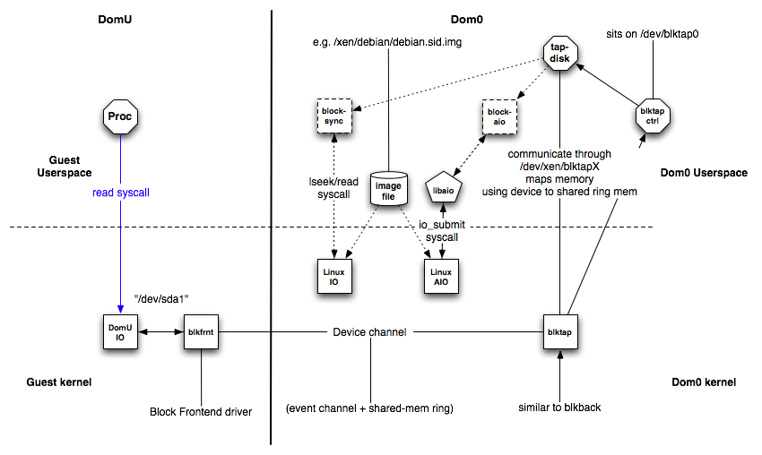

> 从2010年4月开始Xen 4.0使用了`blktap2`替代了`blktap`

# blktap概览

`blktap`即`block tap`用户空间toolkit提供了用户级别的磁盘I/O接口。它的当前主应用程序是用来代替基于文件镜像的常用loopback以提供更好的性能。`blktap`机制包括了一个运行在Dom0的内核驱动，作为现有Xen/Linux `blkback`驱动的相似活动，以及一系列相关用户级别库。使用这些工具，`blktap`允许虚拟化块设备输出到VM中是通过用户空间实现的并且后端可以使用 raw 分区，文件，网络，等等。

# blktap优点

`blktap`的主要优点是它易于使用并且快速写入块后端，并且这些用户级别后端执行非常好，特别是：

* 元数据磁盘格式，例如Copy-on-Write，加密磁盘，稀疏格式一起其他压缩特性非常容易实现
* 从用户空间访问基于文件的磁盘镜像避免了刷新脏页（由Linux loopback驱动表述）的问题。（特别是，对一个基于NFS镜像的大量写入不会导致 OOM killer）
* 每个磁盘的处理程序进程激活了简明的和块资源相关用户空间策略，以及进程颗粒度（process-granularity）QoS技术（磁盘调度算法和相关工具）可能细致地作用于块设备。
* 非常易于获得用户空间特性，例如网络库文件，压缩工具，点对点文件共享系统等等来实现更为复杂的块设备后端。
* crash自包含 -- 迭代开发/调试非常快速

# 使用工具

准备镜像用于启动。对于`qcow`文件使用qcow工具安装较方便（也从 `tools/blktap/` 目录）。`qcow-create`可以创建一个空的独立镜像或者一个基于文件的CoW镜像。`img2qcow`获取一个现有镜像或者分区来创建一个稀疏的独立基于qcow文件。

用户空间磁盘代理`blktapctrl`是通过xend来自动配置和启动。我们也可以手工启动

```
blktapctrl
```

定制VM配置文件来使用`tap` handler，并跟着驱动类型，例如，一个raw镜像作为文件或者分区：

```
disk = ['tap:aio:<FILENAME>,sda1,w']
```

或者是一个qcow映像：

```
disk = ['tap:qcow:<FILENAME>,sda1,w']
```

以下是支持的磁盘类型

* Raw Images（或者是分区或者是一个映像文件）
* 文件后端的Qcow磁盘
* 独立的稀疏Qcow磁盘
* VM之间快速的共享内存磁盘（需要使用某种基于集群的文件系统支持，如在guest内核使用 OCFS2 ）
* 一些VMDK镜像

raw和QCow镜像有异步后端，所以执行性能很好。VMDK则基于直接的qemu vmdk驱动，是同步后端，所以性能较慢。

# 在Dom0中使用blktap驱动挂载镜像

Tap(和blkback)磁盘可以在Dom0中挂载，而不需要运行的VM来attach。需要编译个xenlinux Dom0内核包含`blkfront`驱动。简单地使用`xm`命令行工具来激活一个backend磁盘，并且`blkfront`将保证虚拟磁盘设备可以作为一个loop设备或分区的同样方式被访问。

通常一个raw镜像可以使用loopback驱动来挂载

```
mount -o loop <FILENAME> /mnt/disk
```

不过，在XEN dom0中，挂载时候不需要使用loop驱动

```
xm block-attach 0 tap:aio:<FILENAME> /dev/xvda1 w 0
mount /dev/xvda1 /mntdisk
```

> 请注意，这里`xm block-attach 0`表示在Dom0上添加虚拟磁盘，如果是给虚拟机添加磁盘，则可以指定虚拟机名字代替这里的`0`

类似的，可以使用baktap用户空间toolkit构建用户空间设备类型驱动来打开或者挂载qcow磁盘。

# blktap工作原理

## 原理简述

结合内核`blktap`驱动，所有从VM发出的磁盘I/O请求都通过一个字符设备传递给用户空间daemon（使用一个共享的内存接口）。每个活跃的磁盘都被映射到一个独立设备节点，通过每个磁盘进程来实现独立的期望的块设备。用户空间驱动使用异步实现（Linux libaio），基于`O_DIRECT`调用用于保护非缓存的，批量以及异步请求发送合并到现有的blkback代码中。这个简单的，异步虚拟磁盘接口使得其易于添加新的磁盘实现。

## 原理详细描述

### blktap组件

`blktap`包含以下组件：

* 在Dom0中的`blktap`内核驱动
* 在DomU中的`blkfront`驱动实例
* [XenBus](https://wiki.xenproject.org/wiki/XenBus)连接`blkfront`和`blktap`

这类似于通用的XenSplitDrivers架构。在Dom0中增加的`blktap`有以下组件：

* `/dev/blktap0` 是Dom0中的一个字符设备 （ECS对应位于`/dev/xen/blktap0`）
* `/dev/xen/blktapX` 这里X是相当于虚拟磁盘的对应数字
* `blktapctrl` 一个运行在用户空间的daemon，用于控制新虚拟磁盘的创建
* `tapdisk` 每个`tapdisk`进程运行在用户空间后端是一个或多个镜像文件
* `/var/run/tap/tapctrlreadX`,`/var/run/tap/tapctrlwriteX` 用于在独立的`tapdisk进`程和`blktapctrl`之间使用`write_msg`和`read_msg`功能进行通讯的命名管道
* 前端环（frontend ring, `fe_ring`）用于从Guest VM到用户空间的`tapdisk`之间映射I/O请求的数据
* 一个共享的环(`sring`)用于通讯

Linux内核驱动在`/drivers/xen/blktap/`执行ioctl, poll 和 mmap 系统调用



在 XEN 虚拟机内部执行以下命令可以看到`blkfront`内核模块

```
lsmod | grep blkfront
```

输出显示

```
xen_blkfront           16108  2
```

在dom0物理服务器检查内核模块

```
lsmod | grep blk
```

```
xen_blkback_28         76433  3
xen_blkback            15673  1 [permanent]
blktap                 38645  0
blkback_pagemap         2842  2 xen_blkback,blktap
...
```

当xend启动时，用户空间的`blktapctrl` daemon也同时启动。当启动Guest VM时XenBus被初始化。新虚拟磁盘的请求被传送给`blktapctrl`，就会创建一个新的字符设备和2个命名管道用于和新fork出来的 tapdisk 进程通讯。

在打开了字符设备之后，使用`mmap`系统调用将共享内存映射到`fe_ring`。`tapdisk`进程打开映像文件并且发送有关映像的大小信息给`blktapctrl`，`blktapctrl`将记录这个信息。初始化之后，`tapdisk`在两个命名管道上执行一个选择的系统调用。发生事件是，`tapdisk`检查`tap-fd`是否设置，如果设置就尝试从前端环（the frontend ring）读取请求。

XenStore使用XenBus连接DomU和Dom0以便能够在前端和后端连接中协商。当设置了后端和前端之后，一个共享环（shared ring）内存页和一个事件通道被协商确立。两者都被用于今后的前端和后端通讯。在Guest VM中I/O请求由Guest操作系统处理并转发使用这两个通讯通道。

blktap驱动通知相应的`blktapctrl`或者`tapdisk`进程是基于通过返回投票和唤醒各自的tapdisk进程来确定事件类型。在`ring.h`中描述了共享的前端环（shared frontend ring）。

`tapdisk`从前端环读取请求，并且在同步I/O读取，立即返回给请求。在异步I/O的情况中，请求是发送给Linux AIO子系统。两者机制都从镜像文件读取。在异步案例中，当I/O请求完成后，tapdisk检查使用非块设备系统调用`io_getevents`。

完成请求的信息在前端环中传递。`blktap`驱动通过`tapdisk`进程使用ioctl系统调用来通知。

### 源代码组织

用户空间驱动和程序源代码位于 `tools/blktap/`

不同的用户空间驱动定义在以下源代码文件

| 用户空间驱动 | I/O类型 |
| ---- | ---- |
| Raw文件/分区 | 异步 |
| Raw文件/分区 | 同步 |
| Ramdisk | 同步 |
| QCow镜像 | 异步 |
| VMware镜像 - .vmdk文件 | 同步 |

有关`blktap`实际内核驱动代码位于 `linux-2.6-xen-sparse/drivers/xen/blktap/` ，主要功能定义在 `blktap.c`。

# 使用案例

* 首先在内核分配一个次要数值（minor number）

```
tap-ctl allocate
```

此时输出的设备就是新创建的`blktap`，这个路径将用户后续的块设备

```
/dev/xen/blktap-2/tapdev4
```

* 启动一个`tapdisk`进程

```
tap-ctl spawn
```

显示输出

```
tapdisk spawned with pid 28453
```

* 现在连接两者

```
tap-ctl attach -m 4 -p 28453
```

* 最后需要打开一个VHD设备

```
tap-ctl open -m 4 -p 28453 -a vhd:/path/to/vhd
```

或者打开一个raw文件

```
tap-ctl open -m 4 -p 28453 -a aio:/path/to/raw/file
```

或者是一个NBD服务器

```
tap-ctl open -m 4 -p 28453 -a nbd:127.0.0.1:8000
```

也可以打开一个第二设备用于镜像

```
tap-ctl open -m 4 -p 28453 -a vhd:/path/to/vhd -2
```

* 要关闭tapdisk镜像

```
tap-ctl close -m 4 -p 28453
```

* 从内核卸载`tapdisk`进程，这个动作也会杀掉`tapdisk`进程

```
tap-ctl detach -m 4 -p 28453
```

* 释放内核次要设备数字

```
tap-ctl free -m 4
```

* 最后查看以下状态

```
tap-ctl stats -m 4 -p 28453
```

----

> 以下参考 [Adding additional storage devices to a guest](https://www.centos.org/docs/5/html/5.2/Virtualization/sect-Virtualization-Virtualized_block_devices-Adding_additional_storage_devices_to_a_guest.html) 和 [Xen Disk Hot Add (Block Device) Howto](http://backdrift.org/xen-disk-hot-add-block-device-howto)

# 挂载磁盘设备到guest的实践

在XEN guest中支持不同类型存储：

* 本地磁盘分区
* 逻辑卷
* 光纤通道或iSCSI直连
* 主机文件系统中的文件
* 通过虚拟机直接挂载的NFS文件系统
* 通过guest直接访问的iSCSI存储
* 集群文件系统(GFS)

## 添加一个基于文件的的容器到guest

* 创建一个文件或使用一个现有的文件容器（例如ISO文件）

可以使用以下命令创建一个稀疏文件（注意：稀疏文件不能保证数据完整和存在性能问题，所以只能用于测试而不能用于生产环境）

```
dd if=/dev/zero of=disk_sparse_4g.img bs=1M seek=4096 count=0
```

也可以创建一个非稀疏文件（建议使用）

```
dd if=/dev/zero of=disk_nosparse_2g.img bs=1M count=2048
```

* 编辑 `/etc/xen/VirtualMachineName`检查以`disk=`开头的配置，类似

```
disk = [ 'tap:aio:/var/lib/xen/images/rhel5vm01.dsk,xvda,w', ]
```

* 添加新增加的磁盘文件，注意虚拟磁盘命名要依次提曾，例如已经使用了`xvda`则新添加磁盘文件命名为`xvdb`

```
disk = [ 'tap:aio:/var/lib/xen/images/rhel5vm01.dsk,xvda,w',\
'tap:aio:/xen/images/oracle.dsk,xvdb,w', ]
```

如果是添加物理磁盘，也类似如下

```
disk = [ 'tap:aio:/var/lib/xen/images/rhel5vm01.dsk,xvda,w',\
'phy:/dev/sdb1,xvdb,w', ]
```

## 动态添加磁盘

> 在无法重启虚拟机情况下，可以动态添加磁盘

动态添加磁盘的语法如下

```
xm block-attach domain backdev frontdev mode
```

举例

```
xm blok-attach MyVirtualMachine phy:/dev/sdb1 xvdb w
```

举例，使用前文创建的虚拟磁盘文件

```
xm block-attach test_vm tap:aio:/apsara/test_disk/disk_sparse_4g.img /dev/xvdb w
```

此时使用 `virsh dumpxml test_vm` 可以看到如下新增加的磁盘

```
    <disk type='file' device='disk'>
      <driver name='tap' type='aio'/>
      <source file='/apsara/test_disk/disk_sparse_4g.img'/>
      <target dev='/dev/xvdb' bus='ide'/>
    </disk>
```

但是此时在domU虚拟机内部使用`fdisk -l`却看不到新增的磁盘


# 参考

* [Xen wiki: Blktap](https://wiki.xenproject.org/wiki/Blktap)
* [Adding additional storage devices to a guest](https://www.centos.org/docs/5/html/5.2/Virtualization/sect-Virtualization-Virtualized_block_devices-Adding_additional_storage_devices_to_a_guest.html)
* [Xen Disk Hot Add (Block Device) Howto](http://backdrift.org/xen-disk-hot-add-block-device-howto)